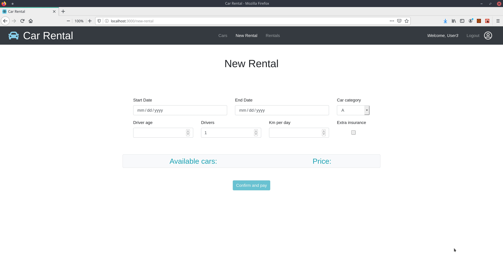

## React client application routes

- Route `/login`: contains the credentials form to log in a user
- Route `/cars`: public page to display and filter the list of cars
- Route `/rentals`: shows the list of all rentals booked by the current user
- Route `/new-rental`: allow the user to book a new rental and pay for it

## REST API server

 Base URL: `/car-rental/rest-api/v1`   
           
- POST `/login`
  - Public
  - Request parameters: none
  - Request body content: username and password
  - Response body content: username, password and user id

- GET `/cars`
  - Public
  - Request parameters: none
  - Request body content: none
  - Response body content: list of car objects
  
- POST `/logout`
  - Public
  - Request parameters: none
  - Request body content: none
  - Response body content: none
  
- POST `/payment`
  - Public
  - Request parameters: none
  - Request body content: credit card number, full name, CVV and rental id
  - Response body content: none
  
- GET `/user`
  - Requires authentication
  - Request parameters: none
  - Request body content: none
  - Response body content: username and user id
  
- GET `/rentals?user=id`
  - Requires authentication
  - Request parameters: user id
  - Request body content: none
  - Response body content: list of rental objects
  
- POST `/rentals`
  - Requires authentication
  - Request parameters: none
  - Request body content: rental object
  - Response body content: rental object and outcome
  
- DELETE `/rentals/:id`
  - Requires authentication
  - Request parameters: rental id
  - Request body content: none
  - Response body content: none
  
- POST `/price`
  - Requires authentication
  - Request parameters: none
  - Request body content: rental object
  - Response body content: rental price and available cars

## Server database

- Table `user` - contains: id username password
- Table `car` - contains: id brand model category
- Table `rental` - contains: id userId carId startDate endDate driverAge driversNumber extraInsurance kmPerDay discountApplies price paid

## Main React Components

- `App` (in `App.js`): wraps the entire application, manages user login and logout functionalities
- `LoginForm` (in `component/login/LoginForm.js`): manages the login form for the insertion of username and password
-  `CarsManager` (in `component/cars/CarsManager.js`): takes care of the page displaying cars, retrieves data from the server, generates, wraps and applies filters
- `RentalsManager` (in `component/rentals/RentalsManager.js`): handles retrieval, separation by date, display and deletion of rentals
- `Configurator` (in `component/configurator/Configurator.js`): manages the insertion of a new rental booking and the relative payment
- `NewRentalForm` (in `component/configurator/NewRentalForm.js`): manages the form for a new rental and the computation of price and available cars
- `PaymentModal` (in `component/configurator/PaymentModal.js`): contains the form for payment info insertion

## Screenshot

## Test users

* User1, user1pw
* User2, user2pw
* User3, user3pw (frequent customer)
* User4, user4pw
* User5, user5pw
* User6, user6pw
